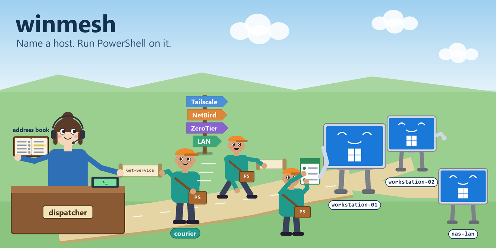
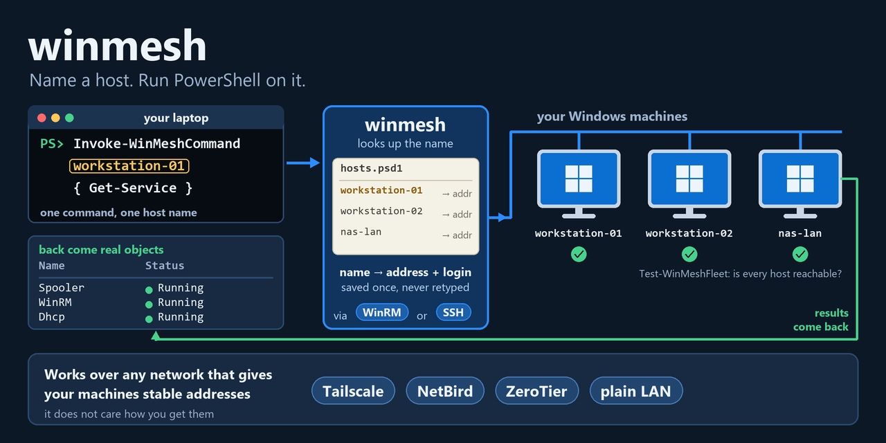

<p align="center">
  
</p>

<h1 align="center">winmesh</h1>

<p align="center"><b>Name a machine, run PowerShell on it — one config file, two stock transports (WinRM or SSH), real objects back, on any network. With channel health checks, firewall scoping for WinRM, a local credential store and optional SSH-server installers. For admins and devs with a handful of Windows boxes — and the Linux and macOS machines next to them.</b></p>

<p align="center">
  <a href="LICENSE"></a>
  <a href="https://learn.microsoft.com/powershell/"></a>
  <a href="#platforms"></a>
  <a href="https://learn.microsoft.com/windows/win32/winrm/portal"></a>
  <a href="winmesh.psd1"></a>
</p>

<p align="center"><b>English</b> | <a href="README.ru.md">Русский</a></p>

```powershell
Invoke-WinMeshCommand workstation-01 { hostname; whoami }     # run a command on a host, by name
Test-WinMeshFleet                                             # check every host in the config at once
```

winmesh is a small PowerShell module for linking Windows machines over PowerShell Remoting **or SSH**. You describe your machines once in a config file; after that you name a host, run commands on it, and get real objects back. The controller and the targets can be Windows, Linux or macOS: WinRM between Windows machines, SSH everywhere — see [Platforms](#platforms).

The module has nine commands. Four run things and check things (`Invoke-WinMeshCommand`, `Test-WinMeshHost`, `Test-WinMeshFleet`, `Get-WinMeshConfig`), three prepare the WinRM path (`New-WinMeshBootstrap` for the target, `Register-WinMeshCredential` and `Connect-WinMeshHost` for the controller) and two show and change which networks may reach a host's WinRM port (`Get-`/`Set-WinMeshFirewallScope`). Two optional standalone scripts install an SSH server on a Windows or Linux target. There are no agents and no dependencies beyond PowerShell and, for SSH, an `ssh` client.

It is a small pre-1.0 module (version 0.2.1) built for a few machines, not for large fleets or configuration management, and the repository has no automated test suite — checks are manual, described in [CONTRIBUTING.md](CONTRIBUTING.md). See [Status and known limits](#status-and-known-limits).

**Contents:** [In plain words](#in-plain-words) · [What's inside](#whats-inside) · [How it works](#how-it-works) · [Quick start](#quick-start) · [Prerequisites](#prerequisites) · [Platforms](#platforms) · [Setup, step by step](#setup--step-by-step) · [Usage examples](#usage-examples) · [Over SSH](#over-ssh-instead-of-winrm) · [Allowed subnets and firewall scope](#choosing-allowed-subnets) · [Security notes](#security-notes) · [Commands](#commands) · [Config reference](#config-reference) · [What it does not do](#what-it-deliberately-does-not-do) · [Gotchas](#gotchas-baked-in) · [Troubleshooting](#troubleshooting) · [Status](#status-and-known-limits) · [Docs map](#documentation-map)

## In plain words

### The problem

Once you own more than one computer, you keep wanting to do something on another one: check a service, read a log, copy a file, see whether it is even up. The tools for that exist (PowerShell Remoting, SSH) but each has setup steps and traps that are easy to hit and slow to diagnose: the remote side must be switched on by a local administrator, the firewall port is opened wider than you think, authentication falls back to a mode you did not expect, and SSH hands you text instead of PowerShell objects, with quoting rules that differ between shells.

### Who it is for

People who run a handful of machines — workstations, a NAS, lab boxes, a few Linux or macOS hosts — and want to address them by a short name from one place, on whatever network links them (Tailscale, NetBird, ZeroTier or a plain LAN). It is for the person who finds Ansible too heavy for this job. Advanced users get per-host transport and firewall scope, a scriptable health check with a structured result, and a transport whose internals are documented below.

### What you get

- **One way to say "run this there".** `Invoke-WinMeshCommand <name> { ... }` works the same whether the host is reached over WinRM or SSH; the transport is one config field per host.
- **Objects, not text.** Results come back as PowerShell objects you can pipe and filter, over either transport.
- **Any network.** winmesh only needs stable, mutually reachable addresses, not any particular network: Tailscale, NetBird, ZeroTier or a plain LAN work the same way.
- **A map of your machines.** One `config/hosts.psd1` with a short name, an address and (for WinRM) a credential id per host, plus defaults you can override per host.
- **Know before you rely on it.** `Test-WinMeshHost` and `Test-WinMeshFleet` check the whole chain — port, response, credentials, an actual command, privilege level — and return a structured result that scripts can gate on.
- **A narrower WinRM exposure.** The bootstrap script restricts the WinRM port to the subnets you list, and `Get-`/`Set-WinMeshFirewallScope` show and re-apply that later, with a guard against locking yourself out.
- **A local credential store.** WinRM credentials are encrypted with DPAPI and kept outside git.
- **Lessons already built in.** A long list of WinRM, firewall, SSH-quoting and localization traps is handled in the scripts and [written down](#gotchas-baked-in).

### What it is not

- Not a new protocol and not an agent: under the hood it is stock WinRM with `Invoke-Command`, or stock `ssh`.
- Not configuration management and not for large fleets (use Ansible or DSC for that). Fleet checks run host by host, not in parallel.
- Not a way around the first admin step: enabling WinRM needs a local administrator on the target, so the module only generates the script.
- Not a secret manager for SSH: it never prompts for, stores or forwards an SSH key or password (`BatchMode=yes`).
- Not WinRM from Linux or macOS: that path needs a Windows controller. Use SSH there.
- Not an SSH-server installer built into the module: the optional scripts are standalone and are never called by it.

### Glossary

| Term | Meaning here |
|---|---|
| **Controller** | The machine you run winmesh *from* (your laptop). It holds the config and the credential store. |
| **Target** | A machine you want to reach. It runs the WinRM listener or an SSH server. |
| **Host entry** | One machine in `config/hosts.psd1`: a short name, an address and transport settings. |
| **Transport** | How winmesh reaches a host: `winrm` (default) or `ssh`, set per host. Everything above the transport is the same. |
| **WinRM / PowerShell Remoting** | Windows' built-in remote-management channel (HTTP port 5985 here), driven by `Invoke-Command`. |
| **Bootstrap** | The one-time script you run on a target as Administrator to enable WinRM and narrow its firewall. |
| **Overlay network** | A VPN-style network (Tailscale, NetBird, ZeroTier) that gives machines stable addresses wherever they are. |
| **`AllowedSubnets`** | The list of source networks allowed to reach a host's WinRM port. `100.64.0.0/10` is the default, the shared range Tailscale and NetBird use. |
| **TrustedHosts** | A client-side WinRM list; connecting by IP address needs the target in it, because Kerberos does not apply. |
| **DPAPI** | The Windows facility that encrypts the saved credential so only your account on this controller can read it. |

## What's inside

Everything listed here is implemented in this repository; the repository labels nothing as experimental or planned. Items marked **WinRM only** need a Windows controller and a WinRM host.

### Addressing and configuration

- **Name-based hosts in one file.** `config/hosts.psd1` (a PowerShell data file, parsed without executing code) lists hosts and defaults; per-host values override defaults; `$env:WINMESH_CONFIG` or `-Config` selects another file. `Get-WinMeshConfig` loads and validates it. → [Config reference](#config-reference)
- **Older key still honoured.** A legacy `TailscaleCidr` default is read as `AllowedSubnets` when `AllowedSubnets` is absent. → [Config reference](#config-reference)

### Running commands

- **`Invoke-WinMeshCommand`.** Run a scriptblock on a named host, with `-ArgumentList`, and get objects back. → [Usage examples](#usage-examples)
- **Two interchangeable transports.** `winrm` (default) uses `Invoke-Command` with a stored credential; `ssh` uses the system `ssh` client with the payload packed as one base64 token and the result serialized with the same CliXml engine remoting uses. → [Over SSH](#over-ssh-instead-of-winrm)
- **Mixed fleets.** Windows, Linux and macOS hosts in one config; SSH works in every direction. → [Platforms](#platforms)

### Checking health

- **`Test-WinMeshHost` / `Test-WinMeshFleet`.** A readable report plus a result object (`Host`, `Address`, `Transport`, `Ok`, `Checks`); `-Quiet` for automation. The checks depend on the transport. → [Test-WinMeshHost in detail](#test-winmeshhost-in-detail)
- **SSH banner.** The SSH check reads the server banner, so you can see which SSH server actually answered. → [Gotchas](#gotchas-baked-in)

### Preparing machines

- **Target bootstrap (WinRM).** `New-WinMeshBootstrap` generates a four-step script: enable PowerShell Remoting, narrow port 5985 to `AllowedSubnets`, grant a full admin token to local accounts in remote sessions, print the facts for your config. → [Setup](#setup--step-by-step)
- **Credential store (WinRM only).** `Register-WinMeshCredential` saves a DPAPI-encrypted credential per id. → [Credential store](#credential-store)
- **Controller setup (WinRM only).** `Connect-WinMeshHost` starts the local WinRM service and adds the target to `TrustedHosts`; honours `-WhatIf`. → [Setup](#setup--step-by-step)
- **SSH server installers (optional).** Standalone scripts that install and start OpenSSH on a Windows or Linux target with TCP/22 restricted to the ranges you pass. → [SSH server setup](docs/ssh-server-setup.md)

### Controlling network exposure

- **`AllowedSubnets`.** One setting (global, overridable per host) that decides which source networks may reach WinRM. → [Choosing allowed subnets](#choosing-allowed-subnets)
- **`Get-WinMeshFirewallScope` / `Set-WinMeshFirewallScope` (WinRM only).** Compare the live rule with the config and re-apply it; a guard refuses a change that would cut your own live session unless `-Force`; `-WhatIf` previews. → [Firewall scope](#seeing-and-changing-which-networks-may-connect)
- **Security notes.** Why the overlay is the boundary and the firewall range is a second layer. → [Security notes](#security-notes)

### Knowledge you do not have to rediscover

- **Gotchas.** WinRM, firewall, SSH, localized-Windows and Linux/macOS traps from real debugging, baked into the scripts and listed. → [Gotchas baked in](#gotchas-baked-in)
- **Troubleshooting table.** Symptom, cause, fix for the errors the module itself raises. → [Troubleshooting](#troubleshooting)

### Not built (by design or not yet)

No configuration management, parallel fan-out, SSH key or password handling, WinRM from Linux/macOS, or HTTPS (port 5986) handling — see [what it deliberately does not do](#what-it-deliberately-does-not-do) and [Status and known limits](#status-and-known-limits).

## How it works

<p align="center">
  
</p>

1. **Name your machines.** List each target — a short name, an address, a credential id (WinRM) or SSH settings — in `config/hosts.psd1`.
2. **Prepare once.** For a WinRM target, run the generated bootstrap script on it and `Connect-WinMeshHost` on the controller. An SSH target needs only an SSH server.
3. **Run by name.** `Invoke-WinMeshCommand <name> { ... }` picks the host's transport — `winrm` or `ssh` — and runs your scriptblock there.
4. **Get objects back.** Results come back as PowerShell objects you can pipe on.

You do a one-time setup per machine; day to day you just call `Invoke-WinMeshCommand <name> { ... }`.

| Step | WinRM host | SSH host |
|---|---|---|
| Target prep | bootstrap script, run once as Administrator | SSH server (+ PowerShell 7 on Linux/macOS), see [SSH server setup](docs/ssh-server-setup.md) |
| Controller prep | `Register-WinMeshCredential`, `Connect-WinMeshHost` (Windows only) | none — the `ssh` client authenticates on its own |
| Run | `Invoke-Command -ComputerName <address> -Credential <stored>` | `ssh ... <shell> -EncodedCommand <base64>` |
| Result | objects from remoting | objects rebuilt from CliXml |
| Check | port 5985, WS-Management, credentials, command, admin token | port 22 + banner, command, admin token (Windows) or root/not root (Linux/macOS) |

## Quick start

From a clone of this repo on the **controller** (your laptop). Admin rights are needed only for the bootstrap on the target and for `Connect-WinMeshHost`. Each step is explained in [Setup — step by step](#setup--step-by-step).

```powershell
git clone https://github.com/AndrewMoryakov/winmesh.git
cd winmesh
Import-Module .\winmesh.psd1

Copy-Item .\config\hosts.example.psd1 .\config\hosts.psd1
notepad .\config\hosts.psd1                       # add your machine (Address + Credential) and set AllowedSubnets

New-WinMeshBootstrap -OutFile .\bootstrap.ps1     # takes AllowedSubnets from the config; copy to the target, run there once as Administrator

Register-WinMeshCredential -Id 'admin@workstation-01'   # login exactly as the bootstrap printed it
Connect-WinMeshHost -Name workstation-01                # controller-side setup (admin, once)
Test-WinMeshHost    -Name workstation-01                # five green checks = success

Invoke-WinMeshCommand workstation-01 { hostname; whoami }
```

Create the config **before** generating the bootstrap: `New-WinMeshBootstrap` takes the firewall scope from `AllowedSubnets` in `config\hosts.psd1`, and without a config it falls back to `100.64.0.0/10` (the Tailscale/NetBird range) — a controller on a plain LAN or ZeroTier would then be locked out. Or pass `-AllowedSubnets` explicitly — see [Choosing allowed subnets](#choosing-allowed-subnets).

Targets reached over **SSH** skip the bootstrap, the credential and the `Connect-WinMeshHost` steps entirely — they need none of the WinRM changes. See [Over SSH instead of WinRM](#over-ssh-instead-of-winrm).

---

## Prerequisites

- Windows PowerShell 5.1 **or** PowerShell 7 on Windows machines; PowerShell 7 (`pwsh`) on Linux and macOS machines — controller and targets alike. See [Platforms](#platforms).
- A network that gives the machines stable, mutually reachable addresses (Tailscale / NetBird / ZeroTier / LAN).
- Administrator rights for exactly two steps: `Connect-WinMeshHost` on the controller, and the bootstrap script on each target.

---

## Platforms

The ssh transport works in every direction; WinRM needs Windows on both ends.

| Controller ↓ · Target → | Windows | Linux / macOS |
|---|---|---|
| **Windows** (PowerShell 5.1 or 7) | `winrm` or `ssh` | `ssh` |
| **Linux / macOS** (PowerShell 7) | `ssh` | `ssh` |

**Why WinRM stays Windows-to-Windows.** PowerShell 7 on Linux/macOS has no
supported WinRM client (`Invoke-Command -ComputerName`, `Test-WSMan` and the
`WSMan:` drive are missing or depend on the third-party PSWSMan/OMI stack), and
the credential store is DPAPI, which exists only on Windows — off Windows,
`Export-Clixml` writes a password as plain hex. So on a Linux/macOS controller
`Register-WinMeshCredential`, `Connect-WinMeshHost`, `Invoke-WinMeshCommand` and
the firewall-scope commands refuse a WinRM host with a clear message, and
`Test-WinMeshHost` / `Test-WinMeshFleet` report it as a failed `WinRM client`
check instead of stopping — the ssh hosts of a mixed fleet are still checked.

**A Linux or macOS controller.** Install [PowerShell 7](https://learn.microsoft.com/powershell/scripting/install/installing-powershell),
then use the module exactly as on Windows. The config path, `$env:WINMESH_CONFIG`
and `~/.ssh/config` work as usual; `CredentialStore` accepts either separator.

```bash
git clone https://github.com/AndrewMoryakov/winmesh.git
cd winmesh
cp config/hosts.example.psd1 config/hosts.psd1     # hosts with Transport = 'ssh'
pwsh -c 'Import-Module ./winmesh.psd1; Test-WinMeshFleet'
```

**A Linux or macOS target.** It needs an SSH server and PowerShell 7 — the
scriptblock runs in `pwsh` there, and results still come back as objects. Set
`SshShell = 'pwsh'` for the host; the default `powershell` exists only on Windows.

```powershell
'linux-01' = @{
    Address   = '100.100.10.21'
    Transport = 'ssh'
    SshUser   = 'admin'
    SshShell  = 'pwsh'          # or its full path, if the ssh session's PATH misses it
}
```

- **Linux:** install `openssh-server` and [PowerShell 7](https://learn.microsoft.com/powershell/scripting/install/installing-powershell-on-linux) from your distribution's or Microsoft's packages.
- **macOS:** turn on *Remote Login* (System Settings → General → Sharing) and install [PowerShell 7](https://learn.microsoft.com/powershell/scripting/install/installing-powershell-on-macos).
- A non-interactive ssh command skips login profiles, so its `PATH` can differ from your terminal's. If winmesh reports that PowerShell was not found, set `SshShell` to the full path printed by `command -v pwsh` on the target.

On a Linux/macOS target `Test-WinMeshHost` has no *full admin token* check: an
ordinary login is healthy there, and root comes through `sudo`. The *command runs*
line says which it is — e.g. `linux-01 / admin (Linux), not root`.

---

## Setup — step by step

### Step 0 · Install the module (controller)

```powershell
git clone https://github.com/AndrewMoryakov/winmesh.git
cd winmesh
Import-Module .\winmesh.psd1
```

### Step 1 · Prepare each target (run ON the target, once, as admin)

A target can only be reached after WinRM is enabled on it — and enabling it needs a **local administrator on that machine**. There is no way around this remotely: the channel does not exist yet. This is the one manual step.

On the **controller**, generate the bootstrap script:

```powershell
New-WinMeshBootstrap -OutFile .\bootstrap.ps1
```

Copy `bootstrap.ps1` to the target (RDP, USB stick, or GPO in a domain) and run it there **as Administrator**. It will:

1. enable PowerShell Remoting (`Enable-PSRemoting`);
2. narrow the WinRM firewall rule to your trusted subnets (see [Choosing subnets](#choosing-allowed-subnets));
3. grant a full admin token to local accounts in remote sessions;
4. print the machine facts you need for the config (computer name, domain, the exact login string).

Note the printed **LoginForCred** value — you will use it in Step 3.

> The bootstrap takes `AllowedSubnets` from `config\hosts.psd1`. If the config does not exist yet, it falls back to `100.64.0.0/10` — do Step 2 first, or pass `-AllowedSubnets` explicitly (see [Choosing allowed subnets](#choosing-allowed-subnets)).
>
> If the target is already reachable by WinRM, or will be reached over SSH, skip this step.

### Step 2 · Add the target to your config (controller)

```powershell
Copy-Item .\config\hosts.example.psd1 .\config\hosts.psd1
notepad .\config\hosts.psd1
```

Fill in one entry per machine:

```powershell
Hosts = @{
    'workstation-01' = @{
        Address    = '100.100.10.11'          # its overlay/LAN address or DNS name
        Credential = 'admin@workstation-01'   # any id you like; used in Step 3
    }
}
```

### Step 3 · Save the credentials (controller)

```powershell
Register-WinMeshCredential -Id 'admin@workstation-01'
```

A prompt appears. Enter the login exactly as the bootstrap printed it:

- domain machine → `DOMAIN\user`
- workgroup / standalone → `COMPUTERNAME\user` (e.g. `workstation-01\admin`)

The password is encrypted with DPAPI — the file can only be read by *your* account on *this* controller. Copied elsewhere, it is useless.

### Step 4 · Prepare the controller (needs admin, once)

```powershell
Connect-WinMeshHost -Name workstation-01
```

This starts the WinRM service on the controller and adds the target to `TrustedHosts` (required for IP-based auth). Run once per new target address.

### Step 5 · Verify

```powershell
Test-WinMeshHost -Name workstation-01
```

Expect five green checks: port, WS-Management, credentials, command runs, full admin token.

### Step 6 · Use it

```powershell
Invoke-WinMeshCommand workstation-01 { hostname; whoami }
Invoke-WinMeshCommand workstation-01 { param($p) Test-Path $p } -ArgumentList 'C:\Windows'
Test-WinMeshFleet          # check every host in the config at once
```

## Usage examples

Everything below assumes the host `workstation-01` is set up (Steps 1–5).

**Run a command and read the result.** `Invoke-WinMeshCommand` returns real objects, not text — pipe them like anything else:

```powershell
Invoke-WinMeshCommand workstation-01 { Get-Service } |
    Where-Object Status -eq 'Running' |
    Measure-Object
```

**Pass arguments in.** Use `param()` in the block and `-ArgumentList`:

```powershell
Invoke-WinMeshCommand workstation-01 {
    param($name, $days)
    Get-EventLog -LogName System -After (Get-Date).AddDays(-$days) -EntryType Error |
        Where-Object Source -like "*$name*"
} -ArgumentList 'disk', 7
```

**Do the same thing on every machine in the fleet.** Loop over the config:

```powershell
$cfg = Get-WinMeshConfig
foreach ($name in $cfg.Hosts.Keys) {
    $free = Invoke-WinMeshCommand $name {
        (Get-PSDrive C).Free / 1GB
    }
    "{0,-20} {1,6:N1} GB free on C:" -f $name, $free
}
```

**Gate a script on channel health.** `Test-WinMeshHost -Quiet` returns an object with an `Ok` field and no output — good for automation:

```powershell
if (-not (Test-WinMeshHost -Name workstation-01 -Quiet).Ok) {
    throw 'workstation-01 is unreachable — aborting'
}
# ... proceed knowing the channel works
```

**Check the whole fleet in a scheduled job:**

```powershell
$down = (Test-WinMeshFleet -Quiet) | Where-Object { -not $_.Ok }
if ($down) {
    "$($down.Count) machine(s) down: $($down.Host -join ', ')" | Send-Alert   # your notifier
}
```

**Copy files to or from a host.** File transfer needs a live session; open one with the stored credential:

```powershell
$cfg  = Get-WinMeshConfig
$h    = $cfg.Hosts['workstation-01']
$cred = Import-Clixml (Join-Path $cfg.Defaults.CredentialStore "$($h.Credential -replace '[^\w.@-]','_').cred.xml")

$s = New-PSSession -ComputerName $h.Address -Credential $cred
Copy-Item .\report.csv -Destination 'C:\Temp\' -ToSession $s
Copy-Item 'C:\Temp\log.txt' -Destination .\ -FromSession $s
Remove-PSSession $s
```

**Use a different config file** (e.g. staging vs production):

```powershell
$env:WINMESH_CONFIG = 'C:\fleets\staging.psd1'
Test-WinMeshFleet
# or per-call:
Invoke-WinMeshCommand nas-lan { hostname } -Config (Get-WinMeshConfig -Path .\lan.psd1)
```


---

## Over SSH instead of WinRM

WinRM is the default because it is native and returns objects. SSH is the better
choice in two cases: the machines are already joined by an overlay VPN that ships
its own SSH server (NetBird does), or WinRM is unavailable to you — blocked by
policy, or the port is closed and you cannot open it.

Switching a host is one field. Nothing else in your scripts changes:

```powershell
Hosts = @{
    'workstation-02' = @{
        Address   = 'workstation-02'      # overlay name or IP
        Transport = 'ssh'
        SshUser   = 'Administrator'
    }
}
```

```powershell
Test-WinMeshHost    -Name workstation-02
Invoke-WinMeshCommand workstation-02 { Get-Service } | Where-Object Status -eq 'Running'
```

**There is no `Credential` field and no `Connect-WinMeshHost` step.** Over ssh the
client authenticates on its own — a key, an agent, or, on an overlay network, the
peer identity: NetBird's SSH server authenticates the *peer*, so a machine already
in your mesh needs no key at all. Steps 1, 3 and 4 of the setup (bootstrap, credential, `Connect-WinMeshHost`) simply do not apply.

You still get objects back, not text. The scriptblock and its arguments are
base64-packed into `powershell -EncodedCommand` (`pwsh` on Linux/macOS), and the result is serialized on
the far side with the same CliXml engine remoting uses, then rehydrated here.

**SSH options** — per host or in `Defaults`:

| Key | Default | Meaning |
|---|---|---|
| `SshUser` | *(empty)* | remote account; empty means let `ssh` decide |
| `SshPort` | `22` | |
| `SshShell` | `powershell` | `powershell` (5.1, always present on Windows) or `pwsh`; Linux/macOS targets need `pwsh` or its full path |
| `SshTimeout` | `15` | seconds, becomes `ConnectTimeout` |
| `SshOptions` | `@()` | extra `-o` options, e.g. `@('StrictHostKeyChecking=accept-new')` |

Anything more specific — jump hosts, per-host keys, aliases — belongs in your
`~/.ssh/config`, which `ssh` reads as usual. winmesh does not duplicate it.

### What goes over the wire

For readers who want the internals (`functions/Invoke-WinMeshSsh.ps1`). One call runs, roughly:

```text
ssh -o BatchMode=yes -o ConnectTimeout=<SshTimeout> [-p <SshPort>] [-o <each SshOptions item>] [user@]<Address> \
    "<SshShell> -NoProfile -NonInteractive -EncodedCommand <base64 of UTF-16LE payload>"
```

- **No prompts.** `BatchMode=yes` means `ssh` never asks for a password or passphrase. Authentication must work non-interactively: a key, an agent, or an overlay network's peer identity. `-p` is added only when the port is not 22.
- **The payload** is a small PowerShell script that decodes your arguments (serialized with `PSSerializer`, then base64) and your scriptblock text (base64), runs the block, serializes the result with `PSSerializer` and prints it as one marker line: `@@WINMESH-OK@@<base64>`. A failure inside the block prints `@@WINMESH-ERR@@<base64>` instead.
- **Results.** The marker line is deserialized locally, so you get objects. As with remoting, they are rebuilt from serialized data (property bags), not live objects. Arguments must be serializable the same way.
- **Everything else the remote prints** (`Write-Host`, native command output) is passed through to your host rather than swallowed.
- **Errors.** A failure inside the block is rethrown locally as `winmesh(ssh) <address>: <message>` — only the message text crosses the wire, not the error object. If no marker line comes back at all, the error is `winmesh(ssh) <address>: no response from the target — <ssh output or exit code>`; for exit code 127 (`sh`/`bash`/`zsh`) or 9009 (`cmd.exe`), or output saying the command was not found, it adds the hint to set `SshShell`.
- **The payload is not secret.** It is an ordinary command-line argument; base64 is encoding, not protection. Avoid putting secrets in the scriptblock or `-ArgumentList` — they can appear in process listings and in `-Verbose` output, which prints the full `ssh` argument list. The whole script travels on the command line, so a very large scriptblock may run into command-line length limits (not measured).
- **The port probe** used by `Test-WinMeshHost` opens a plain TCP connection (not `Test-NetConnection`, which is Windows-only) and reads the SSH banner.

### If you use an overlay VPN

`AllowedSubnets` (used by the WinRM bootstrap) applies to WinRM only. If you serve
SSH from Windows OpenSSH rather than the VPN's own server, narrow port 22 yourself:

```powershell
Set-NetFirewallRule -Name 'OpenSSH-Server-In-TCP' -RemoteAddress '100.64.0.0/10'
```

---

## Adding more machines

Repeat **Steps 1–5** for each new target. Day-to-day there is nothing to remember beyond the host's short name.

```powershell
Test-WinMeshFleet          # health of the whole fleet
```

---

## Choosing allowed subnets

The bootstrap narrows the WinRM port to `Defaults.AllowedSubnets` from your config. Pick the value that matches how your machines are linked:

| Network | AllowedSubnets |
|---|---|
| Tailscale / NetBird | `@('100.64.0.0/10')` — the CGNAT range (default) |
| ZeroTier | your network's subnet, e.g. `@('10.147.17.0/24')` |
| Plain LAN | e.g. `@('192.168.1.0/24')` |
| Several at once | `@('192.168.1.0/24','100.64.0.0/10')` |
| Do not narrow (trusted LAN) | `@()` |

You can also pass it directly, ignoring the config default:

```powershell
New-WinMeshBootstrap -AllowedSubnets '192.168.1.0/24' -OutFile .\bootstrap-lan.ps1
```

---

## Seeing and changing which networks may connect

`AllowedSubnets` is the single place that decides which source networks may reach
a host's WinRM port. It is applied at bootstrap; view or re-apply it later without
remembering firewall commands:

```powershell
Get-WinMeshFirewallScope -Name workstation-01            # current scope + whether it matches the config
Set-WinMeshFirewallScope -Name workstation-01 -WhatIf    # preview
Set-WinMeshFirewallScope -Name workstation-01            # apply the config's AllowedSubnets
```

`Set-WinMeshFirewallScope` refuses if narrowing would cut your own live session
(no connected source falls inside the new ranges) — pass `-Force` only at the
console. A host may override the global default with its own `AllowedSubnets`
(e.g. a machine reachable through a different overlay):

```powershell
Hosts = @{
    'nas-zt' = @{
        Address        = '10.147.17.20'
        Credential     = 'admin@nas-zt'
        AllowedSubnets = @('10.147.17.0/24')   # this host only; overrides Defaults
    }
}
```

## Connecting from another network

Two things must both hold to reach a host: the source must be able to *route* to
the machine, and its address must fall inside `AllowedSubnets`.

- **You are physically elsewhere (corporate, hotel, home).** Nothing to change —
  Tailscale/NetBird runs over whatever internet you have, so you stay on the
  overlay and the host is reachable at its overlay address. The usual case.
- **Add another overlay (e.g. ZeroTier).** Join both machines to it, add its
  subnet to `AllowedSubnets` (ZeroTier is not in the `100.64.0.0/10` CGNAT range),
  run `Set-WinMeshFirewallScope`, and add the host's new address to `TrustedHosts`
  on the controller.
- **A specific trusted LAN, no overlay.** Add that subnet — as narrow as possible
  (a `/24`, or a single `/32`) — weighing that anything on it can then reach WinRM.

## Security notes

- **Prefer overlay membership as the boundary.** Reaching a host means being on
  its overlay, which requires your Tailscale/NetBird auth. The firewall range is a
  second layer that rejects the physical LAN and public addresses.
- **Do not open a whole corporate or public subnet to WinRM.** Reach the host over
  the overlay from that network instead; the overlay tunnels over any internet.
- **`AllowedSubnets` replaces, never appends.** List every network you want at once;
  an empty list (`@()`) means "do not narrow" (`Any`) — only for a trusted LAN.
- **WinRM 5985 is Negotiate/Kerberos-encrypted**, not plaintext, but it is still an
  admin channel — keep the source range as tight as the setup allows.
- **The rule's profile still matters.** It applies to Domain+Private; if an overlay
  adapter is categorized Public the rule will not cover it. Keep overlay adapters
  Private, or widen the rule's profile once the source range is set.

## Commands

| Command | What it does | Runs on | Admin |
|---|---|---|---|
| `Get-WinMeshConfig` | load and validate the config | controller | no |
| `Register-WinMeshCredential` | save a target's credentials (DPAPI) — *winrm only, Windows controller* | controller | no |
| `Connect-WinMeshHost` | set up the client: WinRM + TrustedHosts — *winrm only, Windows controller* | controller | **yes** |
| `Test-WinMeshHost` / `Test-WinMeshFleet` | check the channel | controller | no |
| `Invoke-WinMeshCommand` | run a command on a host | controller | no |
| `New-WinMeshBootstrap` | generate the target-prep script | controller | no |
| `Get-WinMeshFirewallScope` / `Set-WinMeshFirewallScope` | show / re-apply which networks may reach WinRM — *winrm only* | controller (acts on the target over WinRM) | no on the controller; the account used on the target must be allowed to change firewall rules |
| *(bootstrap on target)* | enable WinRM, narrow the port — *winrm only* | **target** | **yes** |
| *(optional)* `scripts/windows/Install-Win32OpenSSH.ps1`, `scripts/linux/install-openssh-server.sh` | install and start an SSH server with TCP/22 restricted — see [SSH server setup](docs/ssh-server-setup.md) | **target** | **yes** (Administrator / root) |

Parameters, as defined in the code (`functions/`):

| Command | Parameters |
|---|---|
| `Get-WinMeshConfig` | `-Path` (default: `$env:WINMESH_CONFIG`, else `config/hosts.psd1` next to the module) |
| `Invoke-WinMeshCommand` | `-Name` (position 0), `-ScriptBlock` (position 1), `-ArgumentList`, `-Config` (a config object from `Get-WinMeshConfig`) |
| `Test-WinMeshHost` | `-Name` (position 0), `-Config`, `-Quiet` |
| `Test-WinMeshFleet` | `-Config`, `-Quiet` |
| `New-WinMeshBootstrap` | `-AllowedSubnets`, `-OutFile`, and `-Name` (accepted as a label, but it does not change the generated script) |
| `Register-WinMeshCredential` | `-Id` (required), `-Credential`, `-Store` |
| `Connect-WinMeshHost` | `-Name` (required), `-Config`, `-WhatIf` |
| `Get-WinMeshFirewallScope` | `-Name` (position 0), `-Config` |
| `Set-WinMeshFirewallScope` | `-Name` (position 0), `-Config`, `-Force`, `-WhatIf` |

### Test-WinMeshHost in detail

`Test-WinMeshHost` checks the whole chain, prints a readable report unless `-Quiet` is set, and always returns an object: `Host`, `Address`, `Transport`, `Ok` (true only if every check passed) and `Checks` (a list of `Check`, `Ok`, `Detail`). Which checks run depends on the host's transport:

| Transport | Checks (in order) |
|---|---|
| `winrm` (Windows controller) | `WinRM port 5985` · `WS-Management responds` · `credentials` · `command runs` · `full admin token` (the last two only when credentials and WS-Management passed) |
| `ssh` | `ssh port <n>` with the server banner as detail · `command runs` (shows host, user and OS) · `full admin token` on a Windows target only |
| `winrm` host on a Linux/macOS controller | one failed `WinRM client` check — the host is reported, not an exception, so a mixed fleet is still checked |

On a Linux or macOS SSH target there is no admin-token check: an ordinary login is healthy, root comes through `sudo`, and the *command runs* detail says `root` or `not root`. A `reduced` admin token on a Windows host means the session does not carry a full administrator token (WinRM: the bootstrap sets `LocalAccountTokenFilterPolicy`; SSH: some servers, including the one NetBird ships, hand out a non-elevated session).

`Test-WinMeshFleet` runs `Test-WinMeshHost` for every host in the config one after another, prints a summary and returns the list of result objects. It is a function, so it sets no process exit code — use the `Ok` field.

### Credential store

- **What is saved.** `Register-WinMeshCredential -Id <id>` writes `<id>.cred.xml` (characters outside `[\w.@-]` become `_`) into the credential store, by default `~\.winmesh\creds`, with `Export-Clixml`. On Windows the password in that file is DPAPI-encrypted: only the same account on the same machine can read it.
- **Which login to give.** Domain machine: `DOMAIN\user`; workgroup machine: `COMPUTERNAME\user` — the bootstrap prints the exact string as `LoginForCred`.
- **Prompting.** Without `-Credential` it asks with `Get-Credential` and falls back to console input if no prompt appears.
- **Where it is used.** `Invoke-WinMeshCommand`, `Test-WinMeshHost` and the firewall-scope commands read it by the host's `Credential` id. A missing file raises `No credential '<id>'. Create it: Register-WinMeshCredential -Id '<id>'`.
- **Windows only.** Off Windows `Export-Clixml` would write the password as plain hex, so `Register-WinMeshCredential` refuses to run there. The SSH path does not use this store.

### The bootstrap script

`New-WinMeshBootstrap` returns (or, with `-OutFile`, saves as UTF-8 with BOM) a script with four numbered steps:

1. `Enable-PSRemoting -Force -SkipNetworkProfileCheck` (the overlay adapter is often in the Public profile, which makes a plain `Enable-PSRemoting` refuse).
2. Set `RemoteAddress` on every enabled inbound firewall rule whose local port is 5985 to the allowed subnets. An empty list skips narrowing; if no rule for 5985 is found it prints a warning to check manually.
3. Set `LocalAccountTokenFilterPolicy = 1` in `HKLM:\SOFTWARE\Microsoft\Windows\CurrentVersion\Policies\System`, so local accounts get a full administrator token in remote sessions (needed for non-domain machines and for administrators other than the built-in one).
4. Print the machine facts for the config: `ComputerName`, `Domain`, `InDomain`, `User`, `LoginForCred`.

Subnet precedence: `-AllowedSubnets` if passed, otherwise `Defaults.AllowedSubnets` from the config, otherwise — only if no config can be loaded — `100.64.0.0/10`.

### What changes on your machines

| Where | Change | Made by |
|---|---|---|
| Controller | WinRM service started and set to Automatic; target address added to `TrustedHosts` | `Connect-WinMeshHost` (honours `-WhatIf`) |
| Controller | `<id>.cred.xml` in the credential store | `Register-WinMeshCredential` |
| Target (WinRM) | PowerShell Remoting enabled; `RemoteAddress` of the inbound 5985 rules narrowed; `LocalAccountTokenFilterPolicy = 1` (remote sessions of local accounts get a full admin token) | the generated bootstrap script |
| Target (WinRM) | the same firewall rules re-scoped later | `Set-WinMeshFirewallScope` |
| Target (SSH, optional) | OpenSSH installed and started, rule `winmesh-sshd` for TCP/22 (Windows) or restricted UFW/firewalld rules (Linux), broader TCP/22 allowances disabled or removed | the scripts in `scripts/` — see [SSH server setup](docs/ssh-server-setup.md) |

---

## Config reference

`config/hosts.psd1` is a PowerShell data file (`.psd1`, not YAML — Windows PowerShell 5.1 has no built-in YAML parser, and `.psd1` is parsed safely without executing code). `config/hosts.example.psd1` is the annotated template; your real `config/hosts.psd1` is git-ignored.

```powershell
@{
    Defaults = @{
        Transport       = 'winrm'                  # 'winrm' or 'ssh'
        CredentialStore = '~\.winmesh\creds'       # where encrypted credentials live
        AllowedSubnets  = @('100.64.0.0/10')       # subnets allowed to reach WinRM
    }
    Hosts = @{
        'workstation-01' = @{
            Address    = '100.100.10.11'
            Credential = 'admin@workstation-01'
            Note       = 'optional free-text note'
        }
        'workstation-02' = @{
            Address    = 'workstation-02'          # same fleet, ssh instead of WinRM
            Transport  = 'ssh'
            SshUser    = 'Administrator'           # no Credential: see "Over SSH instead of WinRM"
        }
    }
}
```

Point winmesh at a different config with `$env:WINMESH_CONFIG` or `-Config`/`-Path` parameters.

**Keys.** A key in `Defaults` applies to every host; the same key on a host overrides it, except `CredentialStore`, which is read from `Defaults` only.

| Key | Where | Default | Meaning |
|---|---|---|---|
| `Address` | host | *(required)* | overlay/LAN address or DNS name |
| `Transport` | defaults, host | `winrm` | `winrm` or `ssh`; anything else is rejected |
| `Credential` | host | — | id of the stored credential; **required for `winrm`**, not used for `ssh` |
| `Note` | host | — | free text for you; winmesh does not read it |
| `CredentialStore` | defaults | `~\.winmesh\creds` | credential directory; `~` expands to the home directory and either `\` or `/` works on every OS |
| `AllowedSubnets` | defaults, host | `@('100.64.0.0/10')` | source networks for the WinRM port; `@()` means do not narrow ([details](#choosing-allowed-subnets)) |
| `SshUser`, `SshPort`, `SshShell`, `SshTimeout`, `SshOptions` | defaults, host | see [SSH options](#over-ssh-instead-of-winrm) | ssh transport only |

**Validation.** `Get-WinMeshConfig` fails with a message if the file is missing, if `Hosts` is empty, if a host has no `Address`, if a transport is not `winrm` or `ssh`, or if a `winrm` host has no `Credential`. The legacy default `TailscaleCidr` is used as `AllowedSubnets` when `AllowedSubnets` itself is absent. The command returns an object with `Path`, `Defaults` (merged with the built-in defaults) and `Hosts`; the other commands accept it through `-Config`.

---

## What it deliberately does *not* do

- **Does not bypass the first admin step on a target.** That is impossible in principle; the module only generates the script.
- **Does not move credentials between controllers.** A DPAPI file decrypts only where it was created. The store is local by design.
- **Does not manage SSH keys or passwords.** Over ssh, authentication is whatever your `ssh` client already negotiates — a key, an agent, or an overlay network's peer identity. winmesh never prompts, stores, or forwards a secret for the ssh path.
- **The module does not install an SSH server.** Unlike WinRM there is no bootstrap for it: either the overlay VPN already provides one (NetBird does), or you install an OpenSSH server once (plus PowerShell 7 on a Linux/macOS target). For that one step there are optional standalone scripts for Windows and Linux — see [SSH server setup](docs/ssh-server-setup.md).


---

## Gotchas baked in

Collected from real debugging — each one cost time:

- **`Set-Item WSMan:...` blames the remote host when the local WinRM service is actually the problem.** If it is stopped, touching the `WSMan:` drive fails with an error about the target being unreachable. `Connect-WinMeshHost` starts the service first.
- **`Enable-PSRemoting` opens the port with `RemoteAddress=Any`.** Narrowing it to trusted subnets is a mandatory step, built into the bootstrap. Skip it once and the port ends up wider open than you think.
- **TrustedHosts is required even in a domain** when connecting by IP: Kerberos does not apply, so auth falls back to NTLM.
- **Scripts are UTF-8 with BOM.** Without the BOM, Windows PowerShell 5.1 reads non-ASCII as ANSI and fails to parse the file.

Over SSH specifically:

- **`-EncodedCommand` wants base64 of UTF-16LE, not UTF-8.** Encode the payload as UTF-8 and PowerShell either reads garbage or refuses to parse. This is why the transport encodes with `[Text.Encoding]::Unicode`.
- **You cannot hand-quote a command for the remote shell.** Windows OpenSSH runs `cmd.exe` by default, but PowerShell if `DefaultShell` was changed — and the two disagree about quoting. Sending one base64 token sidesteps the question entirely, and the same string works under either shell.
- **`ConvertTo-CliXml` does not exist in Windows PowerShell 5.1.** Use `[System.Management.Automation.PSSerializer]::Serialize()` / `::Deserialize()`, which exist in both 5.1 and 7.
- **On an overlay network, the server answering port 22 may not be the one you configured.** NetBird ships its own SSH server and takes the port on the overlay address, so the Windows OpenSSH service you set up can sit there unused. `Test-WinMeshHost` prints the SSH banner for exactly this reason — read it.
- **A session opened by an overlay's SSH server may not carry a full admin token,** even for an Administrator account. `Test-WinMeshHost` reports this as a separate check rather than letting it surface later as a confusing access-denied.

On a **non-English Windows**, or a domain-joined machine whose DC is unreachable:

- **`IsInRole('Administrators')` is unreliable on a localized Windows — it may
  throw, or return a wrong `$false`.** The built-in group can be localized
  (`BUILTIN\Администраторы` on a Russian install), and the string overload
  resolves by *name*. Measured both ways: on a Russian install where the group
  was localized, the English literal raised `MethodInvocationException`; on
  another box an unmappable name simply returned `$false` (5.1 and 7 alike). The
  localized name, the `[WindowsBuiltInRole]::Administrator` enum, and the raw SID
  all returned the right answer. Either way a healthy channel gets reported as
  `command runs: False` — a throw fails the whole call from *inside* the remote
  scriptblock, and a wrong `$false` is just wrong. Always use the enum or
  `S-1-5-32-544`, never the English name.
- **`icacls` and `Add-LocalGroupMember` fail the same way, for a different
  reason.** Passing the name `"Administrators"` makes Windows resolve it, and on
  a domain-joined machine that query goes to a domain controller — so with the
  DC unreachable you get *"could not establish trust relationship with the
  primary domain"* while doing something entirely local. Well-known SIDs need no
  lookup: `icacls f /grant "*S-1-5-32-544:F" /grant "*S-1-5-18:F"`, and
  `Add-LocalGroupMember -Group (Get-LocalGroup -SID S-1-5-32-544)`.
- **A domain account can pass publickey auth and still fail to open a session.**
  The OpenSSH log shows `Accepted publickey for <user>`, then the client sees
  `Connection reset by peer` — and **nothing further is logged**, because the
  failure is past sshd's logging. Key-based logon builds the user's token via
  S4U, which for a domain account needs a live DC; your own interactive session
  works only because it runs on cached credentials, which sshd cannot use. The
  fix is not an sshd setting — use a **local** account. On a domain-joined
  machine, `Get-LocalGroupMember -SID S-1-5-32-544` usually reveals one already.
- **Pasting a key into a console can split it, and sshd will not tell you.** A
  long `$key = 'ssh-ed25519 …'` line wraps at the console width, the newline
  lands *inside* the string, and `authorized_keys` receives two fragments.
  Malformed lines are skipped silently, so the symptom is a plain
  `Permission denied` with a correct-looking file. Verify with lengths, not by
  eye — a valid ed25519 line is a single ~110-character row:
  `Get-Content $f | ForEach-Object { $_.Length }`.
- **Admin keys live somewhere else entirely.** For any account in the
  administrators group, stock `sshd_config` carries
  `Match Group administrators` → `__PROGRAMDATA__/ssh/administrators_authorized_keys`.
  A key placed in `C:\Users\<name>\.ssh\authorized_keys` is ignored, and so is
  that shared file if its ACL is wider than SYSTEM + Administrators.
- **The rule behind the first two: on a localized Windows, anything that
  resolves or formats through the system locale is a portability bug.** Two
  instances turned up within an hour on the same box — `IsInRole('Administrators')`
  throwing, and a separate CLI whose `toLocaleString()` printed `1 401` where
  `en-US` prints `1,401`, breaking its own output parser. Both look correct on
  an English machine and neither is caught by a Linux test run. Pin the locale
  (`toLocaleString('en-US')`) and address principals by SID.

### Linux and macOS

- **`$IsWindows` does not exist in Windows PowerShell 5.1.** It reads as `$null`,
  so `if ($IsWindows)` quietly classifies every 5.1 machine as non-Windows. A
  scriptblock that may run on a 5.1 target tests `$env:OS -eq 'Windows_NT'`.
- **`WindowsIdentity` throws off Windows.** The admin check that works on every
  Windows target is `PlatformNotSupportedException` on Linux/macOS; there the
  question is `id -u` — and "not root" is normal, not a failure.
- **A backslash is a file-name character on Linux/macOS.** `Join-Path $dir 'config\hosts.psd1'`
  names one file called `config\hosts.psd1`. Join each segment separately.
- **Off Windows, `Export-Clixml` does not encrypt a credential.** The password is
  stored as hex-encoded UTF-16 — readable by anyone who can read the file. That is
  why the credential store (and with it WinRM) is Windows-only.

### Driving a target from a script

- **Do not embed non-ASCII literals in a script you transfer.** A `.ps1`
  carrying Cyrillic came out mangled after `scp`, and PowerShell 5.1 failed to
  parse it — the BOM gotcha above, arriving through a different door. Derive the
  localized string at run time instead, which needs no literal at all:
  `([Security.Principal.SecurityIdentifier]'S-1-5-32-544').Translate([Security.Principal.NTAccount]).Value`.
- **Do not hand-quote an ad-hoc command either.** The transport avoids this by
  base64-packing (see above), but the same trap catches you at the console: a
  one-off `powershell -Command "... try { } catch { } ..."` over `ssh` lost its
  braces to two layers of quoting and died with `MissingCatchOrFinally`. Write a
  file and run `powershell -File`, exactly as the transport effectively does.
- **A large download initiated *on* the target may fail where a push from the
  controller succeeds.** `Invoke-WebRequest` aborted with `IOException` partway
  through a 100 MB file, and a `curl.exe -C -` resume then could not even open
  the partial file, in a directory proven writable moments earlier. `scp` of the
  same bytes from the controller worked first time. Cause not established —
  security software is the obvious suspect, but it was not confirmed. Worth
  knowing as a fallback rather than as an explanation.

## Requirements

Windows PowerShell 5.1 or PowerShell 7 on Windows; PowerShell 7 on Linux and macOS (see [Platforms](#platforms)). A network giving machines stable, mutually reachable addresses — overlay (Tailscale, NetBird, ZeroTier) or plain LAN. Administrator rights only for `Connect-WinMeshHost` on the controller and the bootstrap on each target — neither applies to ssh hosts. For the ssh transport, an `ssh` client on the controller (built into Windows 10/11, Server 2019+, Linux and macOS) and an SSH server on the target — plus PowerShell 7 there if the target is Linux or macOS.

For repeatable target-side OpenSSH installation on Windows (Win32-OpenSSH) and Linux, see [SSH server setup](docs/ssh-server-setup.md). The scripts require the allowed source subnet explicitly, rather than opening TCP/22 to every address.

## Troubleshooting

Messages below are raised by the module itself or reported by `Test-WinMeshHost`.

| Symptom | Likely cause | What to do |
|---|---|---|
| `Config not found: <path>` | no `config/hosts.psd1`, or `$env:WINMESH_CONFIG` points elsewhere | copy `config/hosts.example.psd1` to `config/hosts.psd1` and fill it in |
| `Host '<name>' is not in config <path>` | the name is not a key under `Hosts`, or another config file is loaded | check the key and `$env:WINMESH_CONFIG` |
| `Host '<name>': Credential is missing` | a `winrm` host without a `Credential` id | add the id, or set `Transport = 'ssh'` |
| `No credential '<id>'. Create it: Register-WinMeshCredential ...` | the credential file does not exist on this controller (DPAPI files are not portable) | run `Register-WinMeshCredential -Id '<id>'` here |
| `... needs a Windows controller ...` | a `winrm` host used from a Linux/macOS controller | set `Transport = 'ssh'` for the host |
| `WinRM port 5985` fails, `no connection` | the bootstrap was not run, or the controller's address is outside `AllowedSubnets`, or the machines cannot route to each other | run the bootstrap; check the scope; check the network (overlay joined, same LAN) |
| `WS-Management responds` fails but the port is open | `TrustedHosts` lacks the address, or the target's WinRM is not set up | run `Connect-WinMeshHost -Name <name>` (admin) and the bootstrap |
| `full admin token` reduced | the session has no full administrator token | WinRM: make sure the bootstrap ran (`LocalAccountTokenFilterPolicy`); SSH: some servers, including NetBird's, give a non-elevated session |
| `winmesh(ssh) <address>: no response from the target — ... PowerShell was not found on the target` | `SshShell` is wrong for the target | `pwsh` on Linux/macOS, or the full path printed by `command -v pwsh` on the target |
| `winmesh(ssh) ...` with `Permission denied` or a timeout | the key or agent login does not work non-interactively (`BatchMode=yes`) | make plain `ssh` log in without prompts first; see [Gotchas](#gotchas-baked-in) for key-file traps |
| `Connection reset by peer` right after the log says `Accepted publickey` | a domain account on a domain-joined target with no reachable DC | use a local account — see [Gotchas](#gotchas-baked-in) |
| the `ssh port` banner is not the server you installed | an overlay's own SSH server answers on port 22 | read the banner in the check — see [Gotchas](#gotchas-baked-in) |
| `Set-WinMeshFirewallScope`: `Refusing: no live WinRM source falls inside the new ranges` | applying would lock out your own session | add your source subnet to `AllowedSubnets`; use `-Force` only at the console |
| `Get-WinMeshFirewallScope` reports `InSync = False` | the live rule differs from the config's `AllowedSubnets` | run `Set-WinMeshFirewallScope -Name <name> -WhatIf`, then without `-WhatIf` |
| a script fails to parse on Windows PowerShell 5.1 | file saved without a BOM | save as UTF-8 with BOM |

## Status and known limits

winmesh is at version 0.2.1. It is a small module meant to stay readable in one sitting and dependency-free; it is installed by cloning the repository and importing the manifest (the repository documents no other installation route).

- **No automated test suite.** `CONTRIBUTING.md` describes manual checks: a parse check of every `.ps1`/`.psd1`, `Test-ModuleManifest`, `-WhatIf` behaviour, a smoke test against a real host, and a way to exercise the ssh round trip without a second machine by shadowing `ssh` with a function.
- **WinRM is HTTP on port 5985 only.** The module has no HTTPS (5986) handling. The channel is Negotiate/Kerberos-encrypted, but it is still an admin channel.
- **WinRM needs Windows on both ends.** On a Linux/macOS controller the WinRM commands refuse with a clear message and the health checks report a failed `WinRM client` check.
- **Sequential.** `Test-WinMeshFleet` checks hosts one after another, and `Invoke-WinMeshCommand` targets one host per call; to run something on every host, loop over the config yourself ([example](#usage-examples)).
- **Results are deserialized objects** over both transports (data, not live objects).
- **SSH is non-interactive** (`BatchMode=yes`) and does not manage keys, passwords or host-key policy; use `SshOptions` and `~/.ssh/config` for that.
- **The firewall-scope guard is IPv4 only.** The lock-out check compares live WinRM sources with the new ranges as IPv4 CIDRs, and `Get-WinMeshFirewallScope` compares scopes by network prefix — a light check, not an exact comparison.
- **The firewall rules touched are all enabled inbound rules whose local port is 5985**, on the target.
- **The SSH installers** support `apt`, `dnf`, `yum` and `pacman` on Linux and act on UFW or firewalld only; they do not create accounts or add public keys.
- **Measured claims.** The localized-Windows and download observations in [Gotchas](#gotchas-baked-in) are reported as they were observed; the cause of the failed large download was not established.

## Documentation map

| Document | What it covers |
|---|---|
| This README | the whole module: concepts, setup, usage, SSH transport, subnets, security, commands, config, gotchas, troubleshooting |
| [docs/ssh-server-setup.md](docs/ssh-server-setup.md) | the optional Windows (Win32-OpenSSH) and Linux SSH-server installers, flags, firewall behaviour and verification |
| [config/hosts.example.psd1](config/hosts.example.psd1) | annotated config template, including ZeroTier, LAN, SSH and Linux examples |
| [CONTRIBUTING.md](CONTRIBUTING.md) | scope, coding conventions (each prevents a bug already hit), manual testing, commit rules |
| `functions/` | one file per command (plus the platform and ssh helpers); `Invoke-WinMeshSsh.ps1` holds the ssh transport internals |
| `scripts/windows/`, `scripts/linux/` | the standalone SSH-server installers |
| [LICENSE](LICENSE) | MIT |

## Contributing

Contributions are welcome — see [CONTRIBUTING.md](CONTRIBUTING.md) for scope, conventions, and how to test. The project stays deliberately small and dependency-free.

## License

MIT — see [LICENSE](LICENSE).
